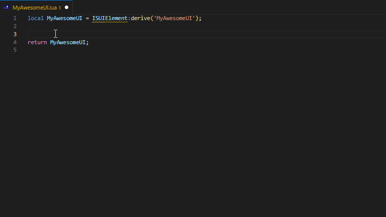

# PZ-Wallet - VSCode Extension

A VSCode extension for Lua snippets and templates for modding the game \"Project Zomboid\".

## Features

- auto-complete typing `wallet-<template>` to apply snippets & templates.

## How to use

- Open the `.lua` file in VSCode.
- Type `wallet-`
- Select one of the snippets or templates and hit ENTER.
- The snippet or template is applied to the text cursor in your document.

## How to install the project
- Clone the repository
- Execute `git submodule update --remote`. This will pull the templates from [PZ-Wallet-Templates](https://github.com/asledgehammer/PZ-Wallet-Templates).
- execute `npm i`
- run `npm run watch` to compile the TypeScript to JavaScript in the `out/` folder.
- Hit `F5` to start the debugger in VSCode. This will open up a new VSCode window with the extension loaded.
- Open or create a new file with the `Lua` language selected.
- Type `wallet-` and you should see templates populate.

## Update Templates
Templates are located in `%USER_HOME%/documents/asledgehammer/vscode/pz-wallet/templates/`. The PZ-Wallet-Templates 
repository is checked and pulled everytime the extension loads. Other templates may be placed inside the templates folder.

## Commands

### PZ-Wallet: Reload Templates
Reloads templates without relaunching vscode to update them.

### PZ-Wallet: Open Templates Folder
Opens a new vscode window pointing at the templates folder mentioned above.

## Release Notes

## [41.78.0]
- Initial release.

